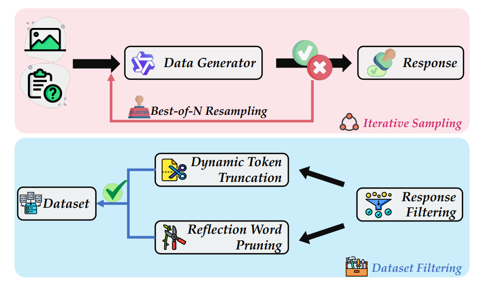

## Mitigating Visual Forgetting via Take-along Visual Conditioning for Multi-modal Long CoT Reasoning

<p align="left">
    <a href='https://www.lamda.nju.edu.cn/sunhl/' target='_blank'>Hai-Long Sun<sup>1,2,3</sup></a>&emsp;
    <a href='https://scholar.google.com.hk/citations?user=Y-3iZ9EAAAAJ&hl=zh-CN&oi=ao' target='_blank'>Zhun Sun<sup>3</sup></a>&emsp;
    <a href='https://scholar.google.com/citations?user=UYlhQS8AAAAJ&hl=zh-CN' target='_blank'>Houwen Peng<sup>3</sup></a>&emsp;
   <a href='https://www.lamda.nju.edu.cn/yehj/' target='_blank'>Han-Jia Ye<sup>1,2,&#x2709</sup></a>&emsp;
</p>


<p align="left"><sup>1</sup>School of Artificial Intelligence, Nanjing University &ensp; <sup>2</sup>National Key Laboratory for Novel Software Technology, Nanjing University&ensp; <sup>3</sup>Tencent&ensp; </p>

<p align="left"><sup>&ensp; &#x2709</sup>  Corresponding Author</p>

<p align="center">
  <a href='https://sun-hailong.github.io/projects/TVC/'></a>
  <a href='https://arxiv.org/abs/2503.13360'></a>
  <a href='https://huggingface.co/Allen8/TVC-72B'></a>
  <a href='https://huggingface.co/datasets/Allen8/TVC-Data'></a>
  <!-- <a href=""></a>-->
  <a href="https://hits.sh/github.com/sun-hailong/TVC/"></a>

</p>

---

## 📢 News

- 🎉[18/3/2025] The TVC is released! Check our [project page](https://sun-hailong.github.io/projects/TVC/), [model weights](https://huggingface.co/Allen8/TVC-72B), [arXiv paper](https://arxiv.org/pdf/2503.13360) for the strong multi-modal reasoning model!

- 🔥[06/3/2025] We release the training data and model, welcome to have a try!

- 🔥[22/2/2025] [TVC-72B](https://huggingface.co/Allen8/TVC-72B) achieves state-of-the-art performance on average across five mathematical reasoning benchmarks.

## 🚀Coming Soon

- [ ] Evaluation code
- [x] Training code
- [x] Model weights
- [x] Training Data

## 🌟 Introduction

**TVC** (Take-along Visual Conditioning) is a strategy that shifts image input to critical reasoning stages and compresses redundant visual tokens via dynamic pruning. This methodology helps the model retain attention to the visual components throughout the reasoning.

<p align="center" width="100%">

</p>
<div>

### Architecture

<p align="center" width="100%">

</p>
<div>

The TVC method consists of two key stages: training and testing. In the training stage, we introduce Dynamic Visual Reaffirmation (DVR), which guides the model through iterative reinforcement of visual evidence during long reasoning chains. In the testing phase, we present Periodic Visual Calibration (PVC), where visual reactivation is periodically triggered at self-reflection intervals.

### Data Generation Pipeline

<p align="center" width="100%">

</p>
<div>

We use iterative distillation to collect long-chain reasoning data, followed by a comprehensive response filtering process to ensure high-quality reasoning.


### Performance

<p align="center" width="100%">

</p>
<div>

We conduct evaluation experiments across 6 benchmarks, covering both general reasoning and task-specific reasoning assessments. TVC exhibits notable effectiveness and generalizability when applied to Qwen2-VL, surpassing other state-of-the-art MLLMs by a large margin.

## Installation

```bash
python -m venv llama-factory
source llama-factory/bin/activate
pip uninstall -y accelerate vllm matplotlib
cd LLaMA-Factory
pip install -r requirement.txt
```

You can also follow https://github.com/hiyouga/LLaMA-Factory to prepare the environment.


## Quick Start

```python
from vllm import LLM, SamplingParams
from PIL import Image

model_name = "Allen8/TVC-72B"
llm = LLM(
        model=model_name,
        trust_remote_code=True,
        tensor_parallel_size=8,
    )

question = "Hint: Please answer the question requiring an integer answer and provide the final value, e.g., 1, 2, 3, at the end.\nQuestion: Subtract all red things. Subtract all tiny matte balls. How many objects are left?\nPlease answer the question using a long-chain reasoning style and think step by step."
placeholder = "<|image_pad|>"
prompt = ("<|im_start|>system\nYou are a helpful assistant.<|im_end|>\n"
f"<|im_start|>user\n<|vision_start|>{placeholder}<|vision_end|>"
f"{question}<|im_end|>\n"
"<|im_start|>assistant\n")

sampling_params = SamplingParams(
    temperature=0.0,
    top_k=1,
    top_p=1.0,
    stop_token_ids=[],
    repetition_penalty=1.05,
    max_tokens=8192
)

image = Image.open("images/case1.png")
inputs = {
            "prompt": prompt,
            "multi_modal_data": {
                "image": image
            },
        }

outputs = llm.generate([inputs], sampling_params=sampling_params)
print(outputs[0].outputs[0].text)
```

## Evaluation

Coming Soon, Stay tuned!

## Training
We use [LLaMA-Factory](https://github.com/hiyouga/LLaMA-Factory) to fine-tune Qwen2-VL-72B-Instruct.

```bash
cd LLaMA-Factory
bash tvc-sft/scripts/train_qwen2vl_72b.sh
```

## Case Study
<p align="center" width="100%">

</p>
<div>

## Citation

If you find it useful for your research and applications, please cite our paper using this BibTeX:
```bibtex
@article{sun2024mitigating,
    title={Mitigating Visual Forgetting via Take-along Visual Conditioning for Multi-modal Long CoT Reasoning},
    author={Sun, Hai-Long and Sun, Zhun and Peng, Houwen and Ye, Han-Jia},
    journal={arXiv preprint arXiv:2503.13360},
    year={2025}
}
```

## Acknowledgement

- Our codebase is conducted on [LLaMA-Factory](https://github.com/hiyouga/LLaMA-Factory)

- Thanks [VLMEvalKit](https://github.com/open-compass/VLMEvalKit) for the evaluation system!
